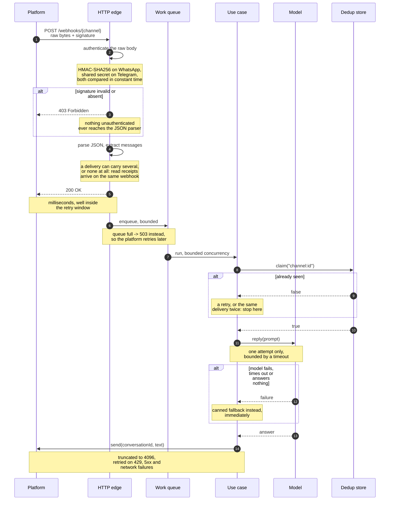
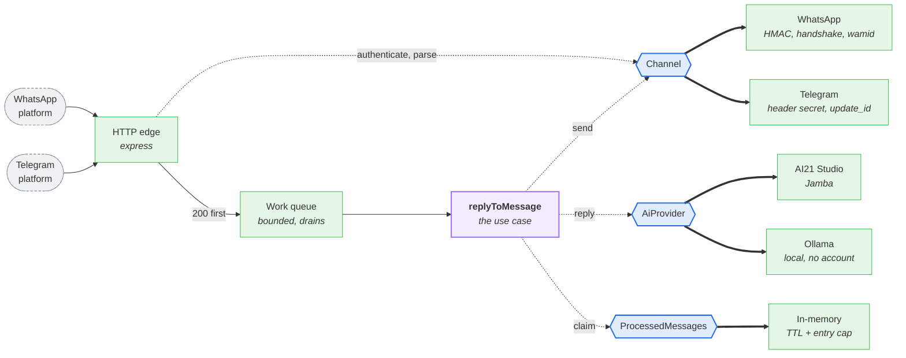
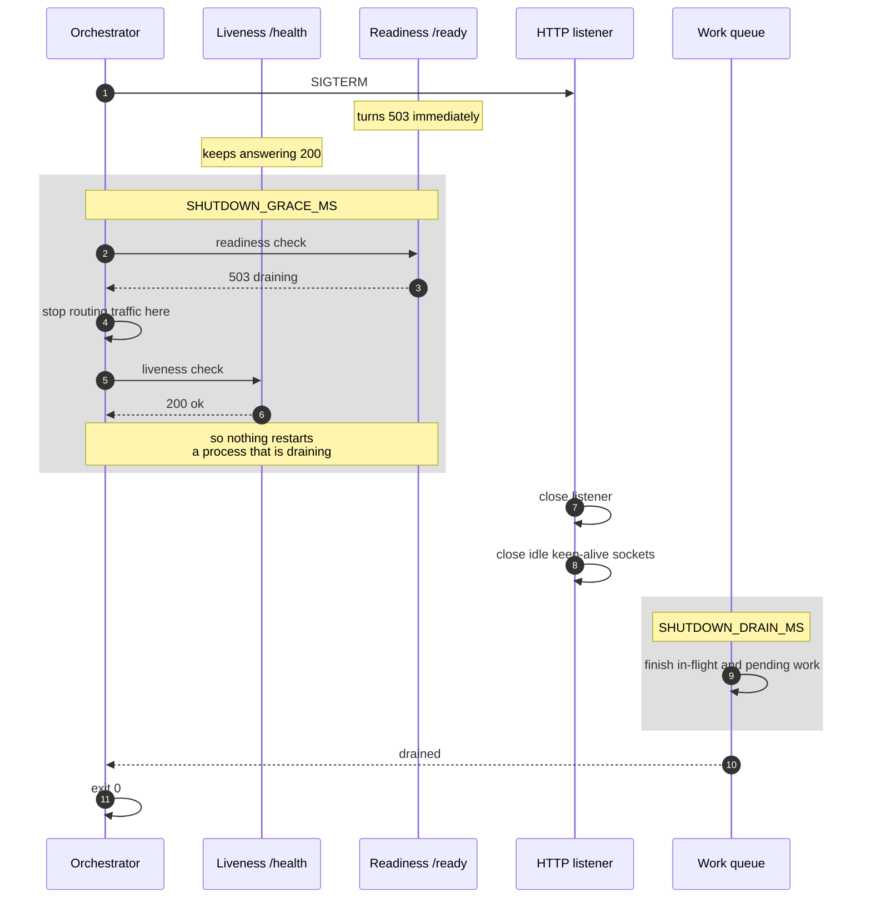

# messaging-llm-bridge

[](https://github.com/sergio-santiago/messaging-llm-bridge/actions/workflows/ci.yml)
[](https://nodejs.org)
[](https://nodejs.org/api/typescript.html)
[](package.json)
[](tests)
[](LICENSE)

**Messaging webhooks answered by a language model, with the parts that are easy to get wrong done right: verified signatures, acknowledgement before the work, and idempotent delivery.**

Two messaging platforms in, two model providers out, three ports in between. WhatsApp Business and Telegram are inbound channels, AI21 Studio and a local Ollama are the model behind them, and neither side knows the other exists.

```
                    signature verified
                    over the raw bytes
                            |
   WhatsApp  ──┐            v            ┌──  AI21 Studio
               ├──>  [ this service ]  ──┤
   Telegram  ──┘            |            └──  Ollama (local)
                            v
                     200 in milliseconds,
                     work happens behind it
```

---

## Table of contents

- [Why a webhook is not a plain POST endpoint](#why-a-webhook-is-not-a-plain-post-endpoint)
- [How a message flows](#how-a-message-flows)
- [Architecture](#architecture)
- [Design decisions](#design-decisions)
- [Shutting down without dropping work](#shutting-down-without-dropping-work)
- [Running it](#running-it)
- [Configuration](#configuration)
- [Testing](#testing)
- [Known limits](#known-limits)
- [Repository layout](#repository-layout)

---

## Why a webhook is not a plain POST endpoint

Receiving a message and answering it looks like twenty lines of code. It is, right up to the point where it meets a real platform. Four things make it harder than it looks, and all four are invisible until they bite.

**1. Anyone who learns the URL can talk to you.** A webhook endpoint is public by definition. Without a signature check, a stranger posts a payload shaped like a message and the bot answers it, using your model quota and your phone number. Meta signs every delivery with HMAC-SHA256 over the request body, Telegram sends a shared secret in a header, and verifying either one is optional in the sense that the platform will not stop you from skipping it.

**2. The signature covers bytes, not JSON.** The HMAC is computed over the exact bytes received. Parse the body first and re-serialise it to check the signature and it will not match, because `{"a":1}` and `{ "a": 1 }` are the same document and different bytes. The raw buffer has to survive to the check.

**3. Slow answers become duplicate answers.** Platforms retry any delivery they do not see acknowledged. Meta keeps retrying, with decreasing frequency, for up to 36 hours. A language model that takes four seconds is a delivery that looks failed, so the platform sends it again, and a naive service answers the same question twice. The fix is not a faster model, it is acknowledging receipt before doing the work.

**4. Which means the service has to be idempotent.** Once acknowledgement and work are separated, retries are guaranteed rather than hypothetical, and every delivery carries an id precisely so it can be recognised the second time.

None of this is specific to chatbots. It is the same shape as a payment provider webhook, and getting it wrong there costs more than a duplicate reply.

---

## How a message flows



The important arrow in that diagram is step 5, the `200 OK`, and how early it appears. Everything below it happens after the platform has already been told the delivery arrived, which is what turns a slow model from a correctness problem into a latency one.

---

## Architecture

Ports and adapters, sized for what the project actually is. Three ports, six implementations, one use case, and wiring done by hand in a composition root.



Reading left to right: platforms, inbound infrastructure, the use case, the ports it depends on, and the adapters behind them. Hexagons are ports, dotted lines are dependencies, thick lines are implementations. The two channel adapters also call their own platform back to deliver the reply, an arrow left out of the drawing to keep it acyclic and readable.

Two details are worth reading twice.

**A channel adapter is used from two places.** The HTTP edge asks it to authenticate and parse, the use case asks it to send. That is one adapter behind one port, not an inbound and an outbound pair, which is why `Channel` has `authenticate`, `parse` and `send` on it rather than being split in half. Splitting it would mean the knowledge of what WhatsApp is lives in two files.

**The use case never touches HTTP.** It receives a channel and a message and calls methods. It has no idea that a socket exists, which is why it can be tested without one.

### The three ports

| Port | What it abstracts | Implementations |
|---|---|---|
| `Channel` | how a platform authenticates, is read and is answered | WhatsApp, Telegram |
| `AiProvider` | turning a prompt into an answer | AI21 Studio, Ollama |
| `ProcessedMessages` | remembering which deliveries were handled | in-memory, bounded |

Every port has two real implementations, and that is deliberate. A port with one implementation ends up being that implementation's interface under a different name, and nobody notices until the second one arrives and does not fit. The two channels disagree on everything the port touches:

| | WhatsApp | Telegram |
|---|---|---|
| Authenticity | HMAC-SHA256 over the body | shared secret in a header |
| Covers the payload | yes, tampering is detected | no, only the caller is verified |
| Webhook registration | GET handshake echoing `hub.challenge` | none, registered through `setWebhook` |
| Delivery id | `wamid`, an opaque string | `update_id`, an incrementing integer |
| Messages per delivery | several, across several entries | one |
| Reply destination | the sender's number | `chat.id`, which in a group is not the sender |

That last row is the clearest example of why a second adapter pays for itself. With WhatsApp alone the field would have been called `from`, and it would have been wrong the moment Telegram arrived, because a reply in a group goes to the chat and not to the person. The port calls it `conversationId`.

### Direction of dependencies

`domain` imports nothing. `application` imports only `domain`. `infrastructure` imports both. `main.ts` is the only file that reads the environment and the only one that knows which adapter sits behind which port.

There is no container, no service locator and no decorator. With three ports, dependency injection is three arguments to a function, and a framework to do that would be more machinery than the thing it wires.

---

## Design decisions

Each row is a decision, the alternative that was rejected, and why.

| Decision | Rejected alternative | Reasoning |
|---|---|---|
| Acknowledge, then work | answer 200 after the reply is sent | the platform reads a slow model as a failed delivery and retries it, producing a second answer |
| Verify the raw buffer | `express.json({ verify })` | with `verify` the body is already being parsed when the check runs, so unauthenticated bytes reach the parser and a failure surfaces as a body-parser error |
| Constant-time comparison | `===` on the signature | `===` returns at the first differing byte, so how long it takes reveals how much of a guess was right |
| Retry delivery, not the model | retry both, or neither | somebody is waiting on a chat: a canned answer now beats a better answer much later. A lost reply, by contrast, is the failure a user actually notices |
| Honour `Retry-After` | own backoff schedule only | both providers rate limit, and backing off on a schedule they did not ask for is how a 429 becomes a ban |
| Dedup behind a port | a module-level `Map` | in-memory works for one replica and nothing else, so the limitation belongs somewhere it can be swapped out |
| Bound dedup by count and time | TTL only | a 36 hour window with no entry cap is a memory leak waiting for a traffic spike |
| Two probes | one `/health` | a liveness check that sees the draining 503 concludes the process is broken and restarts it, which is exactly when it was finishing accepted work |
| Non-text is a case, not an error | ignore it, or send empty text | `message.text?.body \|\| ''` sends an empty prompt to the model when someone sends a sticker |
| Truncate in the adapter | truncate in the use case | 4096 characters is a platform limit, and the use case does not know which platform it is answering |
| TypeScript run natively | a build step, or plain JavaScript | a port in TypeScript is an interface the compiler checks, and in JavaScript it is a comment. Type stripping is stable from Node 24.12, so neither `tsc` nor a bundler runs to serve a request |
| Platform `fetch` | axios | Node has had `fetch` and `AbortSignal.timeout` for years. One less dependency is one less thing to audit |
| `--env-file` | dotenv | same reasoning, and the runtime does it |
| Fail at boot | fail on first message | a missing access token used to surface as a 401 hours later. Now the process refuses to start and lists every problem at once |
| Ids and counts in logs | log the message | what people write to a bot is private, and a log collector is not the place for it |
| No ngrok in the repository | keep the tunnel service | it is development scaffolding, not part of the service. Two lines of documentation replace a container, a script, three Make targets and a variable |

### What was removed

The previous version of this repository was 4 KB of JavaScript with no tests, no CI and a hardcoded Spanish system prompt that made a general-purpose bridge into a fashion advisor. It also pointed at Graph API `v18.0`, released in September 2023 and long expired, so it could no longer have delivered a message at all.

| Dependency | Replaced by |
|---|---|
| `axios` | `fetch`, built in |
| `dotenv` | `node --env-file-if-exists` |
| `body-parser` | already inside express 5, and unused |
| `nodemon` | `node --watch` |

One runtime dependency remains, express, and one development dependency that never runs in production, `typescript`, used only for `tsc --noEmit`.

---

## Shutting down without dropping work

Separating acknowledgement from work creates an obligation: something has to guarantee that accepted work finishes. That is what makes the shutdown sequence part of the design rather than boilerplate.



The grace period is what makes readiness observable at all. Closing the listener straight away means a health check gets a refused connection rather than a 503, and nothing upstream ever learns the instance is going away. Zero is the right value on a laptop. Behind a load balancer it has to exceed the health check interval.

If the drain deadline passes with work still in flight, the process logs it and exits non-zero, so the failure is visible instead of silent.

---

## Running it

### Fastest path, with no accounts at all

Telegram bots are free and take about a minute to create, and Ollama runs a model on your own machine. This combination needs no API key, no billing and no Meta app.

```bash
# 1. Install a local model
brew install ollama && ollama serve &
ollama pull llama3.2

# 2. Create a bot: message @BotFather on Telegram, send /newbot,
#    and keep the token it gives you

# 3. Configure
make setup                 # installs dependencies, creates .env
```

Set these four values in `.env`:

```ini
CHANNELS=telegram
TELEGRAM_BOT_TOKEN=the-token-from-botfather
TELEGRAM_WEBHOOK_SECRET=run-openssl-rand-hex-32
AI_PROVIDER=ollama
```

```bash
# 4. Run it
make start
```

Telegram needs a public HTTPS URL to deliver to. Expose the port with any tunnel you like, for example `ngrok http 3000` or `cloudflared tunnel --url http://localhost:3000`, then register the webhook, secret included:

```bash
curl "https://api.telegram.org/bot$TELEGRAM_BOT_TOKEN/setWebhook" \
  -d "url=https://your-tunnel-url/webhooks/telegram" \
  -d "secret_token=$TELEGRAM_WEBHOOK_SECRET"
```

Message the bot. The reply comes from the local model.

### WhatsApp Business

Requires a Meta app with the WhatsApp product added.

| Value | Where it comes from |
|---|---|
| `WHATSAPP_APP_SECRET` | App dashboard, Settings, Basic. Signs every inbound payload |
| `WHATSAPP_TOKEN` | WhatsApp, API Setup. Temporary tokens expire in 24 hours |
| `WHATSAPP_PHONE_NUMBER_ID` | WhatsApp, API Setup. The number ID, not the number |
| `WHATSAPP_VERIFY_TOKEN` | you invent it: `openssl rand -hex 32` |

```ini
CHANNELS=whatsapp
WHATSAPP_APP_SECRET=...
WHATSAPP_VERIFY_TOKEN=...
WHATSAPP_TOKEN=...
WHATSAPP_PHONE_NUMBER_ID=...
AI_PROVIDER=ai21
AI21_API_KEY=...
```

In the Meta dashboard, under WhatsApp then Configuration, set the callback URL to `https://your-tunnel-url/webhooks/whatsapp` and the verify token to the same string. Meta calls the GET endpoint, the service echoes the challenge, and the subscription is live. Subscribe to the `messages` field.

Both channels can run at once: `CHANNELS=whatsapp,telegram`.

### With Docker

```bash
make build          # build the image
make up             # start it in the background
make logs           # follow the logs
make down           # stop it

make up-dev         # development overlay: bind mount and reload on change
```

The production compose file does not mount the working tree over the image. The development overlay does, and has to be requested by name, so it cannot be applied by accident.

### Commands

```
make setup       Install dependencies and create .env from the example
make check       Run the whole verification suite, the same one CI runs
make test        Run the tests
make test-watch  Re-run the tests on every change
make typecheck   Typecheck without emitting anything
make start       Run the service against .env
make dev         Run the service with reload on change
make build       Build the image
make up          Start the service in the background
make up-dev      Start the service with the development overlay
make down        Stop the service
make logs        Follow the logs
make sh          Open a shell inside the running container
make clean       Remove containers, volumes and locally built images
```

### Endpoints

| Method | Path | Purpose |
|---|---|---|
| `GET` | `/health` | liveness. Answers 200 while the process can serve, draining included |
| `GET` | `/ready` | readiness. Answers 503 as soon as shutdown begins |
| `GET` | `/webhooks/whatsapp` | Meta registration handshake |
| `POST` | `/webhooks/whatsapp` | signed deliveries |
| `POST` | `/webhooks/telegram` | deliveries carrying the shared secret |

---

## Configuration

Every value has a default except the credentials of the channels and provider in use. The service validates all of it at boot and reports every problem in one go.

### Channels

| Variable | Default | Notes |
|---|---|---|
| `CHANNELS` | `whatsapp` | comma separated: `whatsapp`, `telegram` |
| `WHATSAPP_APP_SECRET` | required | signs inbound payloads |
| `WHATSAPP_VERIFY_TOKEN` | required | echoed during registration |
| `WHATSAPP_TOKEN` | required | bearer token for sending |
| `WHATSAPP_PHONE_NUMBER_ID` | required | the ID, not the number |
| `WHATSAPP_GRAPH_VERSION` | `v26.0` | Meta retires a version around two years after release |
| `TELEGRAM_BOT_TOKEN` | required | from `@BotFather` |
| `TELEGRAM_WEBHOOK_SECRET` | required | the `secret_token` given to `setWebhook` |

### Model

| Variable | Default | Notes |
|---|---|---|
| `AI_PROVIDER` | `ai21` | `ai21` or `ollama` |
| `AI_SYSTEM_PROMPT` | a generic assistant | what the bot is. Configuration, not source code |
| `AI_FALLBACK_TEXT` | see `.env.example` | sent when the model fails |
| `AI_UNSUPPORTED_TEXT` | see `.env.example` | sent for images, stickers and voice notes |
| `AI_TIMEOUT_MS` | `20000` | the entire budget for a model call |
| `AI21_API_KEY` | required for ai21 | |
| `AI21_MODEL` | `jamba-large-1.7` | |
| `AI21_MAX_TOKENS` | `512` | |
| `AI21_TEMPERATURE` | `0.7` | |
| `OLLAMA_BASE_URL` | `http://localhost:11434` | from a container, `http://host.docker.internal:11434` |
| `OLLAMA_MODEL` | `llama3.2` | |

### Delivery, deduplication and queue

| Variable | Default | Notes |
|---|---|---|
| `SEND_TIMEOUT_MS` | `10000` | |
| `SEND_RETRIES` | `2` | only on 429, 5xx and network failures |
| `DEDUP_TTL_MS` | `21600000` | six hours. Meta retries for up to 36 |
| `DEDUP_MAX_ENTRIES` | `10000` | bounded by count as well as by time |
| `QUEUE_CONCURRENCY` | `4` | messages handled at once |
| `QUEUE_MAX_PENDING` | `500` | past this the webhook answers 503 |

### Server and shutdown

| Variable | Default | Notes |
|---|---|---|
| `PORT` | `3000` | |
| `LOG_LEVEL` | `info` | `debug`, `info`, `warn`, `error` |
| `HTTP_MAX_BODY_BYTES` | `131072` | rejected before any signature work |
| `SHUTDOWN_GRACE_MS` | `0` | readiness 503 before the listener closes. Raise it behind a load balancer |
| `SHUTDOWN_DRAIN_MS` | `10000` | how long accepted work gets to finish |

---

## Testing

175 tests across 13 files, in about a second and a half. No Jest, no Vitest, no supertest, no test dependencies at all: `node:test`, `node:assert/strict` and the platform `fetch`.

```bash
make test         # or: node --test
make check        # typecheck and tests, exactly what CI runs
```

| Suite | Covers |
|---|---|
| `signature` | constant-time comparison, byte-level HMAC, one-byte tampering |
| `whatsapp-channel` | signature, handshake, multi-entry payloads, status callbacks, sending |
| `telegram-channel` | header secret, media detection, updates that are not messages |
| `channel-contract` | one set of assertions run against **both** adapters |
| `ai-providers` | one set of assertions run against **both** providers |
| `reply-to-message` | duplicates, fallback, non-text, propagation of delivery failures |
| `work-queue` | concurrency cap, refusal when full, drain, drain timeout |
| `processed-messages` | TTL expiry, oldest-first eviction, per-channel namespacing |
| `fetch-json` | timeouts, retry policy, `Retry-After`, no retry on 4xx |
| `config` | every failure mode, and that all problems are reported at once |
| `webhook-http` | the HTTP edge over a real socket, and that bodies never reach the log |
| `end-to-end` | the whole stack with only the socket doubled |
| `repository` | no Spanish anywhere, and `.env.example` in step with the code |

Clocks, backoff delays and `fetch` are injected, so the suite never waits on real time and never touches the network. Coverage, measured by `node --experimental-test-coverage`:

| Lines | Branches | Functions |
|---|---|---|
| 98.77% | 91.38% | 92.31% |

### Proof that the tests are worth having

A green suite proves the tests ran, not that they would notice a defect. Each row below is a deliberate change to production code, and what the suite did about it.

| Change introduced | Result |
|---|---|
| Deduplication accepts every id | 5 tests fail |
| Channel accepts any signature | 6 fail |
| HTTP edge skips signature verification | 3 fail |
| Handshake stops checking `hub.mode` | 1 fails |
| Truncation to 4096 removed | 4 fail |
| `AbortSignal.timeout` removed | 5 fail |
| Config starts with secrets missing | 13 fail |
| Logs stop redacting phone numbers | 1 fails |
| Dedup key loses its channel prefix | 1 fails |
| 4xx becomes retryable | 1 fails |
| `Retry-After` ignored | 1 fails |
| Queue ignores its concurrency cap | 2 fail |
| Queue accepts work while full | 2 fail |
| Stickers get sent to the model | 2 fail |
| The 200 is delayed until after the work | 3 fail |
| **`timingSafeEqual` replaced by `===`** | **nothing fails** |

That last row is not an oversight, it is a limit. Constant-time comparison is a property of how long something takes, not of what it returns, so a functional test cannot see the difference. It is verified by reading the code, and it is listed here rather than papered over.

---

## Known limits

Stated plainly, because every one of them is a deliberate trade rather than an oversight.

**One instance only.** Deduplication lives in memory, so two replicas keep two separate maps and the same message can be answered once per replica. Fixing it is one adapter: `ProcessedMessages` maps onto Redis `SET key value NX EX ttl` almost exactly. Nothing else in the codebase changes, which is the entire reason it is a port.

**Work in flight does not survive a hard kill.** The queue is memory. `SIGTERM` drains it, so an orderly shutdown loses nothing, and `SHUTDOWN_DRAIN_MS` bounds how long that takes. A `SIGKILL`, an out-of-memory kill or a power cut lose whatever was in flight, and the platform will not retry a delivery it already saw acknowledged. Durability across restarts means a broker, and a broker means a different project.

**Backpressure sheds load rather than buffering it.** Past `QUEUE_MAX_PENDING` the webhook answers 503 and lets the platform retry, which is correct. When a delivery carries several messages and only some fit, the ones that fit are kept, the delivery is acknowledged, and the drop is logged as an error. Answering 503 there would make the platform redeliver the messages already accepted.

**No conversation memory.** Each message is answered on its own, with the system prompt and nothing else. Threading history would need storage per conversation and a policy for how much to keep.

**Constant-time comparison is not covered by a test.** See the last row of the mutation table above.

**Temporary WhatsApp tokens expire in 24 hours.** That is a Meta thing. A production deployment needs a permanent System User token.

---

## Repository layout

```
src/
  domain/
    types.ts                  what a message is, with no platform in it
    ports.ts                  the three ports, and nothing else
  application/
    reply-to-message.ts       the one use case, depends only on domain/
  infrastructure/
    config.ts                 read once, validated once, fails at boot
    logger.ts                 JSON lines, levels, redaction
    fetch-json.ts             the only outbound HTTP, always with a deadline
    work-queue.ts             bounded concurrency, drains on shutdown
    processed-messages.ts     dedup, bounded by TTL and by entry count
    json.ts                   narrowing helpers for third-party payloads
    signature.ts              HMAC and constant-time comparison
    text.ts                   truncation to a platform limit
    channels/
      whatsapp.ts             HMAC, GET handshake, multi-entry payloads
      telegram.ts             header secret, no handshake, update_id
    ai/
      ai21.ts                 Jamba chat completions
      ollama.ts               local model, no credentials
    http/
      server.ts               probes, routes, acknowledge-then-work
  main.ts                     composition root, signals, the only env reader

tests/                        13 files, no test dependencies
  support/doubles.ts          one double per port, plus clock and fetch stubs

.github/workflows/ci.yml      typecheck, test matrix, audit, docker smoke test
compose.yaml                  production
compose.dev.yaml              development overlay, explicit by name
```

---

## License

[MIT](LICENSE)
